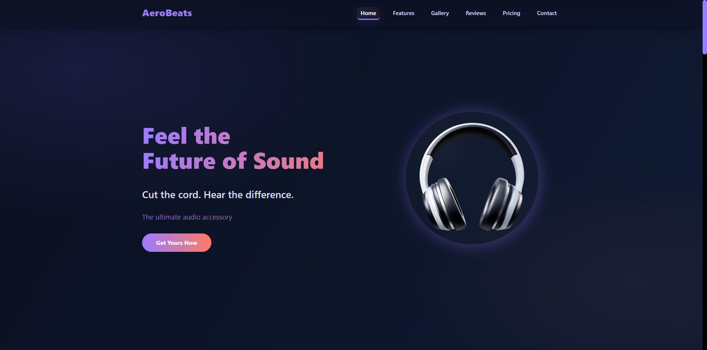
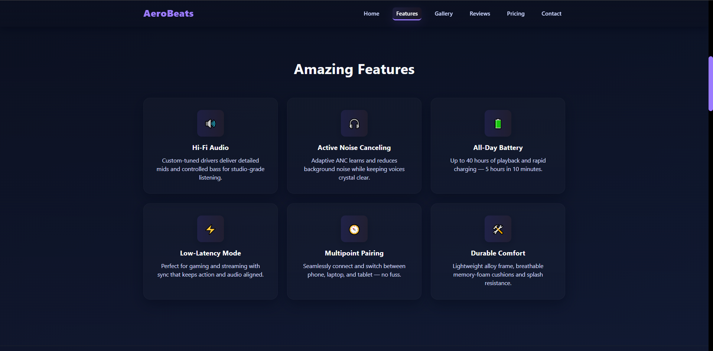
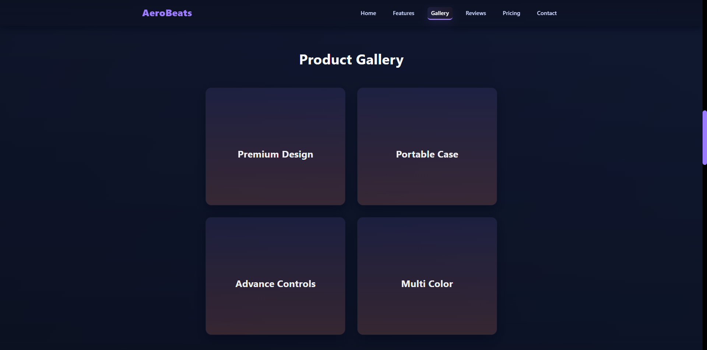
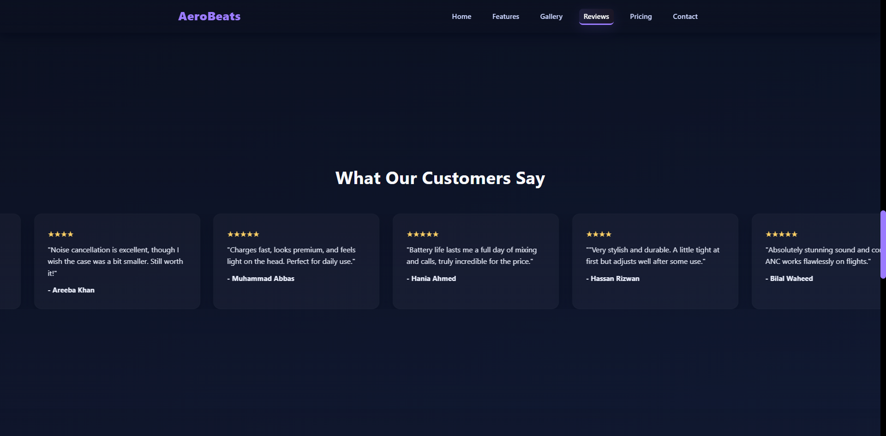
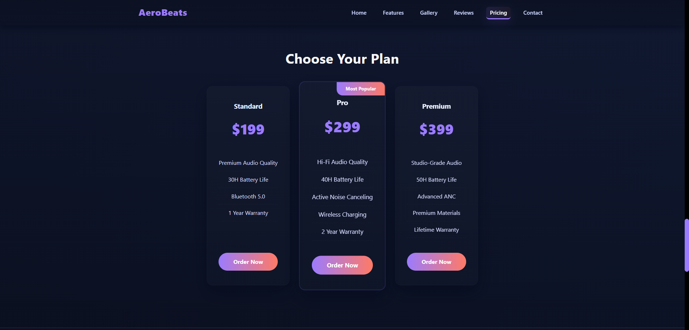
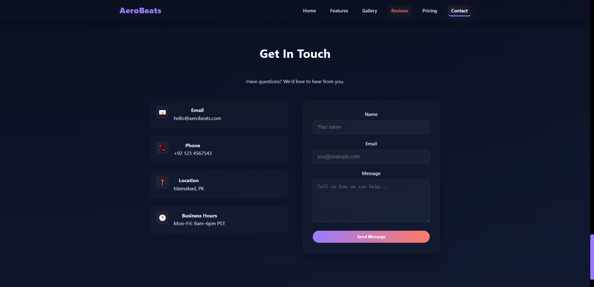
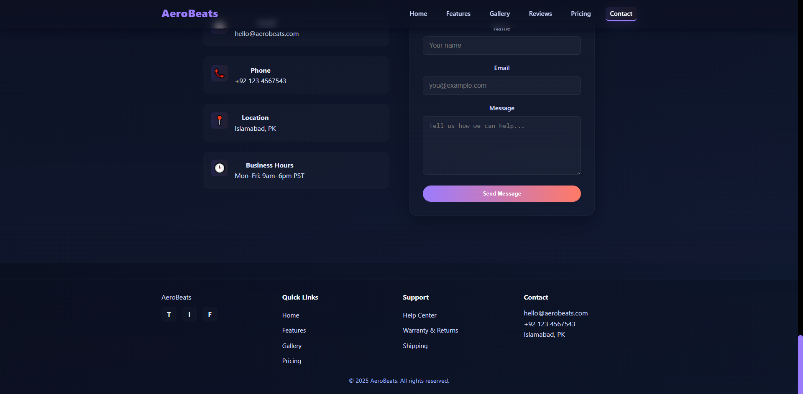

# 🎧 AeroBeats Wireless Headphone — Single Page Product Website  

## 📌 Project Description  
This project is a **Single Page Product Website** designed to showcase a wireless headphone in a modern and interactive way. It has been developed using **HTML, CSS, and JavaScript**, with the addition of **GSAP (GreenSock Animation Platform)** to enhance animations and interactivity.  

The website consists of multiple sections such as Hero, Features, Gallery, Reviews, Pricing, and Contact. Each section is designed to deliver information effectively while maintaining a smooth and engaging user experience. The site is fully responsive, adapting to desktops, tablets, and mobile devices.  

This project demonstrates not only frontend development skills but also the ability to integrate external libraries like GSAP to create dynamic, visually appealing user interfaces.The design emphasizes simplicity, clarity, and animation-driven storytelling to give a professional product showcase feel.  

---

## 🎯 Purpose  
The main purpose of building this project is to **implement frontend development knowledge** in a practical way. It serves as practice for:  
- Strengthening concepts of **HTML structure, CSS styling, and JavaScript interactivity**.  
- Learning and experimenting with **GSAP animations** and its **ScrollTrigger plugin** to create advanced animations.  
- Exploring how libraries and frameworks can enhance user experience and UI design.  
- Creating a **realistic product site** that could be used as part of a professional portfolio.  

This project acts as a **learning milestone**, showing the transition from just static websites to **interactive, modern, and animation-rich interfaces**.  

---

## ✨ Features  
This website is not just a static page, but an **interactive product showcase** with the following features:  

- **Responsive Navigation Bar**  
  The navigation bar adapts to different screen sizes with a hamburger menu for mobile. It also includes an **active link highlight** feature that updates as the user scrolls through sections.  

- **Smooth Scrolling and Scroll Progress Indicator**  
  Users can navigate smoothly between sections, and a scroll indicator bar at the top visually represents the progress through the page.  

- **Hero Section with Advanced Animations**  
  The hero section introduces the product with a rotating and floating headphone image, a tagline, a call-to-action button, and a typewriter effect for dynamic text messages. These animations are handled using GSAP.  

- **Interactive Sections (Features, Gallery, Pricing, Reviews, Contact)**  
  - **Features Grid**: Showcases product highlights with flip animations triggered on scroll.  
  - **Gallery**: Displays product images with zoom-in and hover effects to add interactivity.  
  - **Reviews**: Implements an infinite horizontal scrolling effect for customer reviews, which pauses when hovered.  
  - **Pricing Cards**: Reveal with fade, scale, and blur-removal animations, creating a modern transition.  
  - **Contact Section**: Slides into view with animations, ensuring all sections feel connected.  

- **Extensive Use of GSAP**  
  GSAP powers all animations across the site, such as:  
  - **Scroll-triggered reveals**: Different sections and elements smoothly appear when the user scrolls down the page.  
  - **Floating and rotating product images**: The product images continuously float and rotate to make them look dynamic instead of static.  
  - **Staggered card animations**: Cards appear one after another in a sequence, which creates an organized and professional look.  
  - **Infinite looping reviews**: The reviews move across the screen in a continuous loop to give the impression of an active testimonial feed.  
  - **Typewriter-style text effect**: The hero section text is animated with a typewriter effect, where each letter appears one by one.  
  - **Smooth section transitions**: The transitions between sections are animated smoothly instead of changing abruptly.   

Together, these features make the project a **polished, professional-level landing page**.  

---

## 🛠️ Technologies Used  
The project is built with the following technologies, each serving a specific purpose:  

- **HTML5**  
  Used to structure the website with semantic tags, making the content meaningful and accessible.

- **CSS3**  
  Responsible for styling, layouts, and responsive design. Flexbox and CSS Grid are used for alignment and layout, while transitions and hover effects enhance interactivity.  

- **JavaScript (Vanilla)**  
  Handles DOM manipulation, navigation functionality, smooth scrolling, and integrates GSAP for animations. Intersection Observer is used to detect active sections and update the navbar.  

- **GSAP (GreenSock Animation Platform)**  
  The core animation engine of this project. GSAP is used for timeline-based animations, smooth transitions, hover effects, and infinite loops. Its **ScrollTrigger plugin** enables scroll-based animations, making the website highly engaging and modern.  

---

## 💡 How to Use  
Since this is a **frontend-only project**, it can be run directly in a browser without any special setup.  

1. Clone the repository:  
   ```bash  
   git clone https://github.com/MdAbbas762/aerobeats-product-website.git  

2. Open the project in browser  
   Locate the `index.html` file inside the project folder and open it in any modern web browser (such as Chrome, Edge, or Firefox).  

---

## 🔮 Future Improvements
Although the project already provides a complete and interactive single-page experience, several improvements can be made in the future:

- Expand the project into a **multi-page full website** with additional sections such as FAQs, About, or Blog.  
- Use a **modern frontend framework like React** to manage components more effectively and enhance scalability.  
- Add a **backend system** (e.g., Node.js/Express) to handle contact form submissions.  
- Improve **accessibility** with better ARIA roles and alt text for images.  
- Implement **dark/light mode** for enhanced user preference.  
- Optimize performance further with **lazy loading of images** and better SEO practices.

---

## 📸 Screenshots / Previews

1.   
2.   
3. 
6.   
7.   
8.   
9.   
